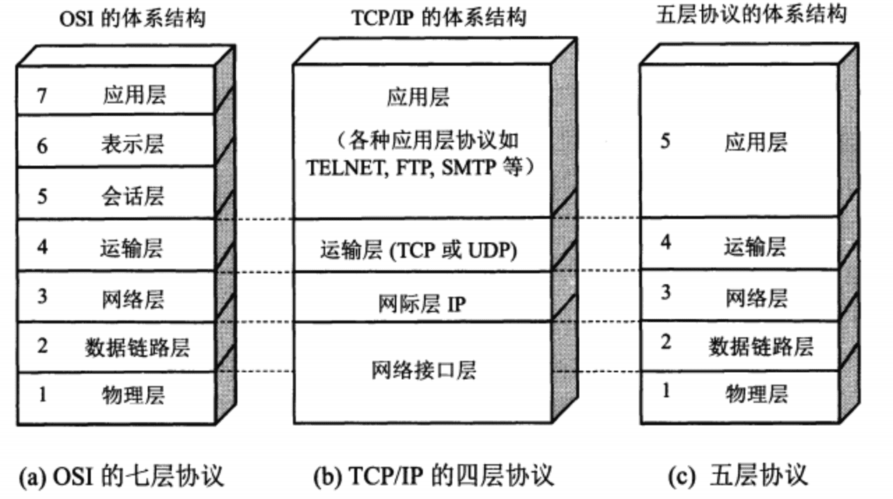
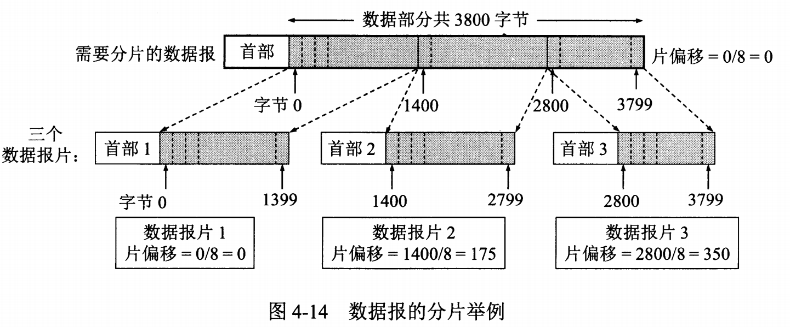
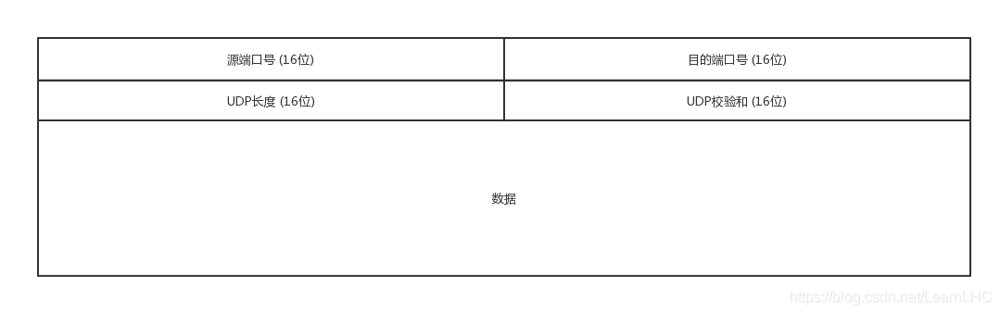
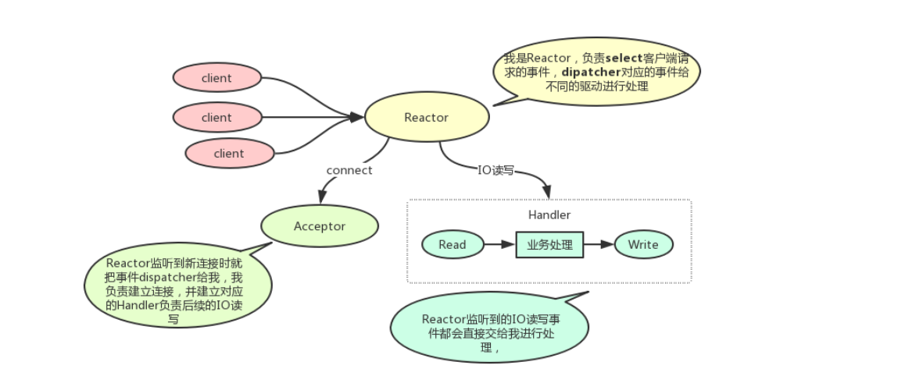
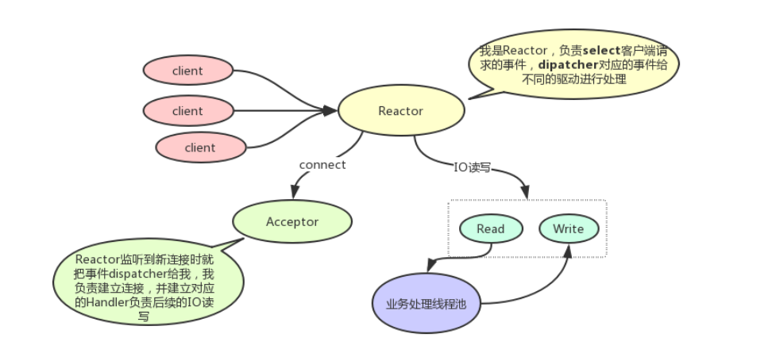
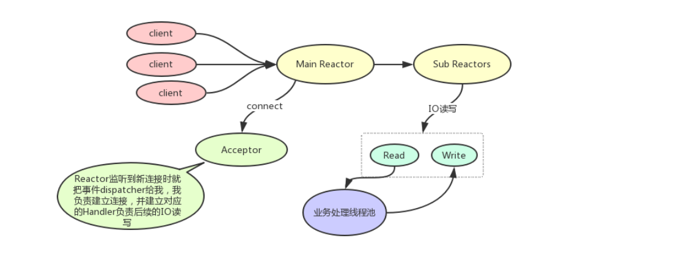
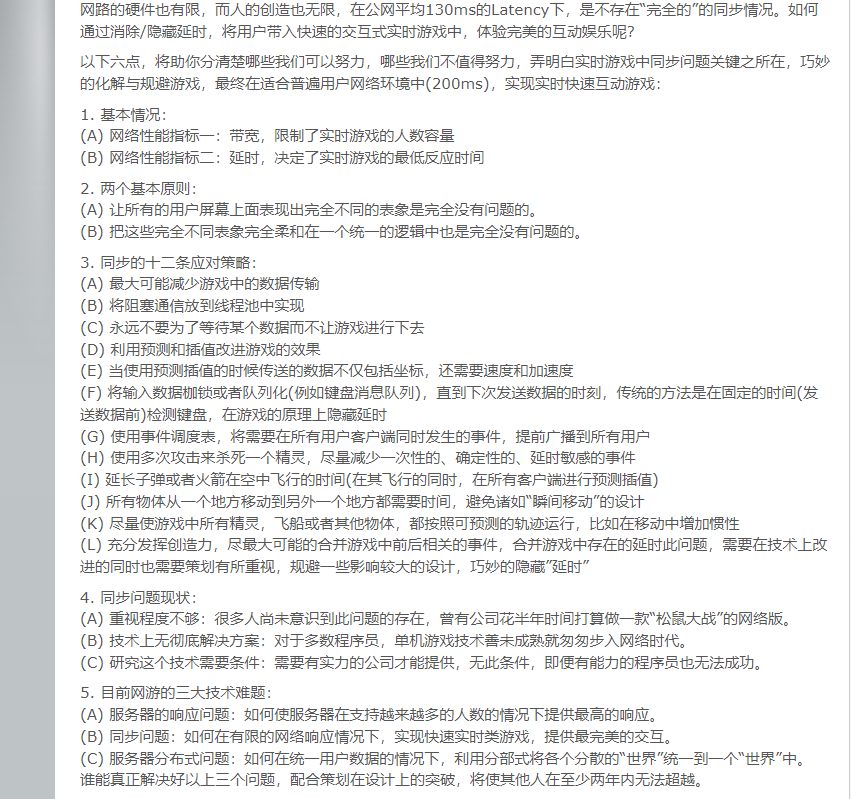
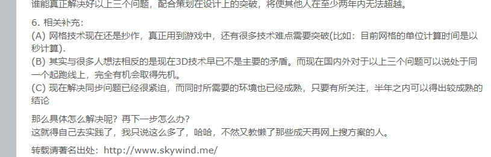

 [韦一笑](https://www.skywind.me/blog/archives/2746)


## Java

 

1.Java中的引用类型 强软弱虚

-  Java中的引用类型有哪些

Java中的引用就是指针，指向一个地址空间

强引用：只要这个引用指向了一个对象

软引用：-Xms --Xmx 当内存空间足够的时候他能在，当内存空间不够的时候可以把他GC掉

```java
SoftReference<byte[]> softReference = new SoftReference<>(new byte[1024 * 1024 * 10]);
```

**软引用非常适合缓存**，如果用一个软引用指向一个对象，当内存不足是就可以清理掉这部分内存

并且软引用只能用softRefrence来包装

弱引用：只要GC 这个引用的对象就会被干掉

```java
WeakReference<byte[]> weakReference = new WeakReference<>(new byte[10]);
```


- ThreadLoacl你了解吗

  只有自己设置进入的这个线程能够读取数据，线程私有的容器

- ThreadLoacl应用在什么地方

- ThreadLoacl会产生内存泄漏你了解吗

Java并发编程

Java常规数据模式

Java的语言特性 JVM 泛型 构造函数（父类）类加载器 、线程池、线程、


## Go

GMP

协程

哲学 正交 简洁


## 2. 网络



物理层

数据链路层：传递的是数据帧[帧头 帧尾]  在这一层，数据的单位称为帧(frame)

网络层：IP 在这一层，数据的单位称为数据包(packet)

运输层：UDP、TCP 数据单元也称作数据包(packets)。但是，当你谈论TCP等具体的协议时又有特殊的叫法，TCP的数据单元称为段 (segments)而UDP协议的数据单元称为“数据报(datagrams)”。

应用层：APP 应用层为操作系统或网络应用程序提供访问网络服务的接口。应用层协议的代表包括：Telnet、FTP、HTTP、SNMP等


[资源1](https://www.cnblogs.com/guoxiaoyu/p/17707285.html)


### IP层：

>- `IP协议`（在网络层）及其配套协议（在数据链路层的`ARP协议`，在网络层的`ICMP，IGMP协议`）等
>- IPV6详解
>- 网络地址转换 NAT等

#### IP及配套协议详解

因为网络层是整个互联网的核心，因此应当让网络层尽可能简单。网络层向上只提供简单灵活的、无连接的、尽最大努力交互的数据报服务。

使用 IP 协议，可以把异构的物理网络连接起来，使得在网络层看起来好像是一个统一的网络。

与 IP 协议配套使用的还有三个协议：

- 地址解析协议 ARP（Address Resolution Protocol）
- 网际控制报文协议 ICMP（Internet Control Message Protocol）
- 网际组管理协议 IGMP（Internet Group Management Protocol）

**IP 数据报格式**


版号：有4（IPV4）和6（IPV6）两个值

首部长度：占4位，最大值为15

区分服务：用来获得更好的服务，一般情况下不使用

总长度：包括首部长度和数据长度（65535） 首部长度-20字节

生存时间：TTL 为0是丢弃数据

协议：指发生端的协议，ICMP，TCP，UDP

首部检验和 ：因为数据报每经过一个路由器，都要重新计算检验和，因此检验和不包含数据部分可以减少计算的工作量

标识： 在数据报长度过长从而发生分片的情况下，相同数据报的不同分片具有相同的标识符。

片偏移 ：和标识符一起，用于发生分片的情况。片偏移的单位为 8 字节。



### 1.TCP

> TCP 是一个巨复杂的协议，关于TCP

1.三次握手

client      sync = 1,ack = true,seq = x              server

client                    server

client                    server

客户端请求：sync = 1 ack = 0 seq = x

服务器回复:   sync = 1 ack=1, ack_num = x + 1 seq = y

客户端请求：sync = 0 ack = 1,ack_num = y + 1,seq = x +  1

- 第一次握手（SYN = 1，seq = x）

客户端发送一个TCP的SYN标志位置1的包。指明客户端打算连接的服务器的端口，以及初始序号X，保存在包头序列化（Sequence Number）字段里

发生完毕之后，客户端进入`syn_send` 状态

- 第二次握手（SYN = 1，ACK = 1，seq = y, Acknum = x + 1）

服务器发回确认包（ACK）应答。即SYN标志位和ACK标志位均为1。服务器端选择自己ISN徐丽华，放到Seq域里，同时将确认序号（Ack num）设置为客户端的ISN加1，即X+1。发送完毕后，服务器端进入`syn_revd` 状态

- 第三次握手（ACK =1 ，ACKnum = y +  1）

客户端再次发送确认包（ACK），SYN标志位为0，ACK标志位为1，并且把服务器发来ACK的序号字段+1，放在确定字段中发生给对方，并且在数据段写ISN的+1

发送完毕后，客户端进入`Established` 状态，当

**TCP 头格式**


- TCP的包是没有IP地址的，那是IP层上的事。但是有源端口和目标端口

- 一个TCP连接需要四个元组表示同一个连接（src_ip,src_port,dst_ip,dst_port）准确的说是五元组，还有一个是协议。但是这里只是说TCP协议

- **注意上图中的四个非常重要的东西：**

  - `Sequence Number` 是包的序号，用来解决网络包乱序（recordering）问题
  - `Acknowledgement Number` 就是ACK---用于确认收到，用来解决不丢包的问题
  - `Window` 又叫 `Advertised-Window` 著名的滑动窗口（Sliding Window）用于解决流控制的
  - `TCP Flag` ，也就是包的类型，主要用于控制TCP的状态机的
  
  
  

**TCP的状态机**

 其实，网络上的传输是没有连接的，包括TCP也是一样。而TCP所谓的“连接”，其实只不过是在通讯的双方维护一个“连接状态”，让它看上去好像有连接一样。所以，TCP的状态变换是非常重要的。

其他东西如下：


**很多人会问，为什么建立链接需要3次握手，断链接需要4次挥手？**

- **对于建链接的3次握手，**主要是要初始化Sequence Number的初始化值。通信的双方要互相通知对方自己的初始化的Sequence Number(缩写为ISN：Inital Sequence Number)---所以叫SYN，全称Synchronize Sequence Number.也就是上图中的x和y。这个号要座位以后的数据通信需要，以保证应用层接收到的数据不会因为网络上的传输问题而乱序（TCP会用这个序号来拼接数据）。
- **对于4次挥手，**其实仔细看是2次，因为TCP是全双工的，所以，发送发和接收方都需要Fin和Ack。只不过，有一方是被动的，所以看上去就成了所谓的4次挥手。如果两边同时断链接，那就回进入CLOSING状态，然后达到TIME_WAIT状态。


**TCP重传机制**

TCP要保证所有数据包都可以达到，所以，必须有重传机制。

注意，接收端给发送端的Ack确认只会确认最后一个连续的包，比如，发送端发了1,2,3,4,5一共五份数据，接收端收到了1,2于是回ack3,然后收到了4（注意此时3还没有收到）

**超时重传**

**快速重传**

**SACK 方法**

另外一种更好的方式叫：**Selective Acknowledgment**

#### TCP滑动窗口

需要说明一下，如果不了解TCP滑动窗口，就等于不了解TCP协议。我们都知道，TCP必须要解决的可靠传输以及乱序（recordering）的问题，所以TCP需要知道网络实际的数据处理带宽或是数据数据处理速度，这样才不会引起网络拥塞，导致丢包。

所以，TCP引入了一些技术和设计来做网络流控，Sliding Window是其中一个技术。前面说过，**TCP头里有一个字段叫Wind，又叫Advertised-Window,这个字段是接收端告诉发送端自己还有多少缓冲区可以接收数据，于是发送端就可以根据这个接收端的处理能力来发送数据，而不会导致接收端处理不过来。**


上图中，我们可以看到：

- 发送端的LastByteAcked指向了呗接收端Ack过的位置（表示成功发送确认），LastByteSent表示发出去了，但还没有接收成功的Ack,LastByteWritten指向的是上层应用正在写的地方

- 接收端LastByteRead指向了TCP缓冲区中读到的位置，NextByteExpeted指向的地方是接收到的连续包最后一个位置，LastByteRcved指向的是收到的包最后一个位置，我们可以看出中间有些数据还没到达，所以有数据空白区

于是：

- 接收端在给发送端回ACK中会汇报自己的AdvertisedWindow = MaxRcvBuffer - LastByRcvd - 1;
- 而发送方会根据这个窗口来控制发送数据的大小，以保证接收方可以处理


上图中分成了四个部分，分别是：

- 1已收到ack确认的数据
- 2发送还没收到ack的
- 3在窗口中还没发出的（接收方还有空间）
- 4窗口以外的数据（接收方没有空间）

下面是个滑动后的示意图（收到36的ack,并发出了46-51的字节）


**Zero Window**

上图，我们可以看到一个处理缓慢的Server（接收端）是怎么把Client(发送端)的TCP Sliding Window给降成0的。如果Windows变为0了，TCP会怎么样？是不是发送不了数据了？是的，发送端不发数据了，那如果过一会Window size可用了，怎么通知发送端呐？

**Sily Window Syndrome**

中文意思是“糊涂窗口综合症”。正如上面，如果接收太忙了，来不及取走Receive Windows里的数据，那么，就会导致发送方越来越小。到最后，如果接收方腾出几个字节并告诉发送发现在有几个字节的window,而我们的发送方会义无反顾地发送这几个字节。

要知道，我们的TCP+IP有40个字节，为了几个字节，要搭上这么大的开销，太消耗了

另外 ，网络上有个MTU，对于以太网来说，MTU是1500字节

**如果你的网络包可以塞满MTU，那么你可以用满整个带宽，如果不能，那么你就会浪费带宽**。（大于MTU的包有两种结局，一种是直接被丢了，另一种是会被重新分块打包发送） 你可以想像成一个MTU就相当于一个飞机的最多可以装的人，如果这飞机里满载的话，带宽最高，如果一个飞机只运一个人的话，无疑成本增加了，也而相当二

所以, **Sliy Windows Syndrome这个现象是本来可以坐200人的飞机里只做了一两个人。**要解决这个问题也不难，就是避免对小的window size做出响应，直到有足够大的window size再响应。

**TCP心跳**

### 2.UDP

[资料](https://www.cnblogs.com/god-of-death/p/8044359.html)

[UDP分片](https://www.cnblogs.com/cnlntr/p/16079728.html)

[UDP分片与丢包，UDP真的比TCP高效吗](https://www.eet-china.com/mp/a163639.html)


**UDP的传输方式：面向报文**



UDP报文每个字段的含义如下：

- 源端口：16bit，发送端的端口
- 目的端口：16bit，即接收端的端口
- 长度：16bit,UDP数据包的大小：包头+数据，单位：字节
- 校验值：16bit，错误检查码，基于算法，计算此UDP数据包是否损坏


---


面向报文的传输方式决定了UDP的数据发送方式是一份一份的，也就是应该层交给UDP多长的报文，UDP就照样发送，即一次发送一个报文。那么UDP的报文大小由哪些影响因素呐？UDP数据包的理论长度是多少，合适的UDP包应该是多少呐？

**（1）UDP报文大小的影响因素，主要有一下三个**

- UDP协议本身，UDP协议中有16位的UDP报文长度，那么UDP报文长度不能超过2^16 = 65536
- 以太网（Ethernet）数据帧的长度，数据链路层的MTU（最大传输单元）
- socket的UDP发生缓存区大小

**（2）UDP 数据包最大长度**

根据UDP协议，从UDP数据包的包头可以看出，UDP的最大包长度是2^16-1字节。由于UDP包头占8字节，而在IP层封装后的IP包占去20字节，所以这个是UDP数据包的理论最大长度是2 ^16-1-8=65507字节。如果数据包超过65507字节，send或sendto函数会错误码。如果UDP发送缓冲区大小小于65507字节，在发送一个数据包为65507字节的时候，send或sendto函数会报错错误码

**（3）UDP数据包理想长度**

理论上UDP报文最大长度是65507字节，实际上发送这么大的数据包效果最好吗？UDP是不可靠的传输协议，为了减少丢UDP包的风险，最好控制UDP包在下层协议传输过程中不要被切割。MTU 最大传输单元，这个传输单元实际上和链路层协议有着密切的关系、每个以太网帧都有最小64字节，最大不超过1518字节，对于小于或者大于这个限制的以太网帧我们都可以视之为错误数据帧

在下层数据链路层最大传输单元是1500字节的情况下，要想IP层不分包，那么UDP数据包的大大小应该是1500字节-IP头（20字节）-UDP头（8字节） = 1472字节。**不过鉴于Internet上的标准MTU值为576字节，所以建议在进行Internet的UDP编码时，最好将UDP的数据长度控制在（576-8-20） 548字节以内**

**（4）UDP包分片问题**

如果MTU是1500，Client发送一个8000字节大小的UDP包，那么Server端阻塞模式下解包，在


### HTTP


**GET**

**POST**

**跨域**

**WebSocket**

**Cookies**

**Session**

**Https**


### DNS

域名系统并不像电话号码通讯录那么简单，通讯录主要是单个个体在使用，同一个名字出现在不同个体的通讯录里并不会出现问题。但域名是群里中所有人都在用，必须保持唯一性。


**DNS解析流程**


**DNS 调度原理**

现在，大部分应用和业务都采用域名作为服务器的入口，因此用DNS来负载均衡和区域调度是非常普遍的做法，网易云也有着一套基于DNS的调度系统。某些用户在进行直播

### 知识点串联：输入URL到页面加载过程详解

可以把URL分割成几个部分：协议、网络地址、资源路径

- **传输协议**：URL包含协议部分，是浏览器和www万维网之间的沟通方式，它会告诉浏览器正确在网络上找到资源位置。最常见的网络传输协议是Http协议（超文本传输协议）（https则是进行加密的网络传输）；其他的还有ftp、file、https、mailto、git等。还有自定义的协议（私有协议），例如tencent.
- **网络地址：**指示该连接网络上哪台计算机。可以是域名或者IP地址，可以包含端口号；
- **资源路径：**指示从服务器上获取哪一项资源。

例如：http://www.quaro.com/question/123456/

- 协议部分：http
- 网络地址：www.quaro.com,
- 资源路径：/question/123456/

**查找域名对应的IP地址**

> 通过域名查找IP过程：浏览器缓存-> 系统缓存 -> 本地DNS服务器缓存

- 浏览器搜索自己的DNS缓存（维护一张域名或IP地址对应表）
- 搜索操作系统中的DNS缓存（维护一张域名与IP地址对应表）
- 搜索操作系统的hosts文件（windows环境下，维护一张域名或与IP地址对应表）
- 操作系统域名发送到本地区域服务器（LNDS），进行查找，成功则返回结果（递归查询），失败则发起一个迭代DNS请求（迭代查询）// 迭代查询和递归查询
- 本地域名服务器LDNS将得到的IP地址返回给操心系统，同时也将IP地址缓存起来
- 操作系统将IP地址返回给浏览器，同时将IP地址缓存起来


KCP

### 3.Netty

#### Reactor模型

[高性能Reactor模型概述与实践](https://github.com/Cicizz/binary/blob/master/%E9%AB%98%E6%80%A7%E8%83%BD/%E9%AB%98%E6%80%A7%E8%83%BDReactor/%E9%AB%98%E6%80%A7%E8%83%BDReactor%E6%A8%A1%E5%BC%8F%E6%A6%82%E8%BF%B0%E4%B8%8E%E5%AE%9E%E8%B7%B5.md)

**概述**

什么是Reactor模式？可以翻译为“反应者”模式，一般称为事件驱动模式，在单机高性能开发时，能很好的提高系统单机性能。Reactor模式主要有以下几种：

- 单Reactor单线程：大家经常使用的redis就这样处理IO事件的

- 单Reactor多线程：Java中的NIO的处理，Netty服务中值设置了BossEventLoopGroup(可以理解为线程池)且值为1时，内部运行就是该模式

- 多Reactor多线程：Netty服务中设置了BossEventLoopGroup和WorkerEventLoopGroup，就是该模式，例如：RocketMQ中的Netty组件和IoMQ中就会同时设置这两个值，并且IoTMQ的BossEventLoopGroup设置的要更大一些

  在学习和理解Reactor模式时，先理解下以下概念：

  1. 事件：什么是事件，比如IO中的accept,connect,read,write
  2. Reactor: 反应堆（我理解为的是事件分发器EventDispatcher）。当Reactor监听（轮询或通知）到事件后，根据事件进行不同的处理。
  3. 工作线程：Reactor在监听到事件后，会将事件交给不同的handler（具体处理逻辑的东东）

##### 1.单Reactor单线程



可以看出，Reactor主要监听事件并dispatcher到不同的事件处理器进行处理的。对于单Reactor单线程模式，优点是：

1. 实现相对简单
2. 单线程（单进程）执行所有的逻辑，没有线程（进程）切换的开销

缺点：

对于连接，IO频繁，性能不够，特别是IO读写比较消耗性能，如果当前执行IO读写阻塞了，那么对于新的连接不能进行连接，其余的IO读写操作也会被阻塞

##### 2.单Reactor多线程



如图，相对于单Reactor单线程，主要将IO的业务处理剥离出来，单独用子线程池处理业务逻辑。

优点是：

IO读写handler不再处理业务逻辑，只响应事件并将数据交给业务处理线程池处理，IO读写不再阻塞，提高IO响应的性能

缺点是：

1. IO读写时，具体业务操心需要交给业务处理线程池，期间会涉及到现场的切换，增加一部分消耗，同时对于业务处理线程池可能也处理比较慢，需要做限流处理等。
2. Reactor要同时响应所有时间，如果IO连接，读写都很多，那么IO的读写会降低一部分新连接建立的处理

##### 3.多Reactor多线程



多Reactor多线程模型在netty中使用最多，如果Netty的Boss线程（Main Reactor）与Worker(Sub Reactor)都设置了，其内部的IO模型就是多Reactor多线程模型

- Main Reactor： 主要负责监听新连接事件，监听到新连接事件后交给Acceptor处理（也可能是Main Reactor 监听了就自己处理）

- Sub Reactor： 这里监听的都是已经建立好的连接，主要监听IO读写事件，然后响应给handler进行后续的IO处理

多Reactor多现在就是增加了一个Sub Reactor反应堆（可以理解为一个线程池）单独处理IO读写。减少新连接响应的影响


零拷贝

buffer

channel

C10K问题

### 4.粘包拆包

断线重连

逻辑线程与IO线程

select poll epoll 

大小端

MTU 滑动窗口  

线程的上线文切换

零拷贝

## 3.并发

> 并发产生的原因，如何处理并发。每种语言提供的方案，提到并发对线程是否有清晰的理解

锁 Go中GMP 多线程


## 4.分布式

> 分布式最为重要的是数据一致性，在多个进程中如何保证数据的一致性这里需要认真学习LLL中的思想

rafa

雪花算法

从主从复制

分布式锁 ZK redis

## 5.MongoDB

SQL优化 索引 B树 B+树 红黑树

NoSql的范围查找问题

分片 非关系数据库

存储引擎

SQL合并

事务


## 6.游戏相关

[网络同步法则](https://www.skywind.me/blog/archives/112)





### 网络同步

> 网络同步 = 数据同步 + 表现同步

**一.网络同步概念理解**

随着技术的发展，游戏服务器的架构发展与通常的WEB服务器架构渐行渐远。两者差异化的一个重要原因是 **现代游戏服务器**(更准确的说是游戏逻辑服务器)对网络同步有着很高的即时性要求

在web服务器中只是单纯的从服务器向客户端进行数据同步，不会把其他客户端数据都发给你。而在游戏里，需要让N个客户端显示起来一模一样

在游戏中实时性是一个非常重要的需求尤其是（MMO，FPS这类型的网游）。你可以容忍微信点进去一个文章要花2秒钟，但是你不能接受你的子弹要2秒后才打到敌人。

**网络同步 = 实时的多端数据同步 + 实时的多端表现同步。从计算机的角度来描述，网络同步是一个网络IO与CPU计算同样密集的游戏功能，他对主机CPU的性能要求较高，且单核的性能比并发更为重要**

**二、游戏架构与传统同步**

#### 帧同步 : 大家都是


#### 状态同步


#### 状态帧同步


### 大世界

AOI

压缩广播

九宫格

十字链表

碰撞

ProtocolBuff


----


架构

热更

重登 补包

排行榜

## 7.Linux 操作系统

如何查找线程问题 CPU满了 Socket最大连接数

 常规命令

## 8.算法

[菜鸟算法](https://www.runoob.com/data-structures/shell-sort.html)

[Hello算法 90K](https://www.hello-algo.com/chapter_divide_and_conquer/divide_and_conquer/)

### 复杂度分析

#### 迭代与递归

虽然从计算角度看，迭代与递归可以得到相同的结果，**但它们代表了两种完全不同的思考和解决问题的范式**

- **迭代**：”自下而上“地解决问题。从解决问题。从最基础的步骤开始，然后不断重复或累加这些步骤，直到任务完成。
- **递归：** “自上而下”地解决问题。将原问题分解为更小的子问题，这些子问题和原问题具有相同的形式。接下来将子问题继续分解为更小的子问题。

设问题：**f(n) = 1+2+3+4+5+6+n**

- **迭代 :** 在循环中模拟求和过程，从1遍历到N，每轮执行求和操作，即可求得f(n)
- **递归：** 将问题分解为子问题f(n)=n+f(n-1)，不断（递归地）分解下去，直至情况f(1)=1

排序算法：冒泡、选择、插入、希尔、堆排序、桶排序、快速排序，归并排序

查找算法：二分查找，并查集，图

寻路算法：A*，NevMesh

压缩算法

动态规划

贪心

字符串相关算法

## 9.数据结构

单链表

双向链表

队列

堆栈：这里需要引申出代码如何在线程中进行压栈的

数组

HashMap：

红黑树

多级缓存：L1 L2 L3

LRU：LastRecentUse

跳表


## 10. 设计模式

1.单例

2.构建者

3.桥接

4.抽象工厂

5.工厂方法

6.命令

7.观察者

8.修饰器

9.适配器

10.享元

11.组合

12.策略

## 11.Pulsar

1.缓存行

2.内存对齐

3.ringbuff

## 12.Disruptor

消峰


## 13.GC

常规的GC算法

ZGC

G1

## 14.JVM

启动参数具体意思

## 15.架构设计

数据的流向

如何保证稳定性

RPC：这是一个重点 可以学习航海的RPC

Git的使用：merge rebase、以及一些常用的技巧 不仅仅是自己熟悉的、如何回滚


## 开发中遇到的问题

1.不要相信第三方接口

2.类加载器导致的maven版本

3.多个用户登录数据库导致大世界碰撞

4.分片时大多数返回成功之后就返回成功

5.MongoBD最多一次写入15M数据

6.幂等

7.线上开发，重启服，实际问题